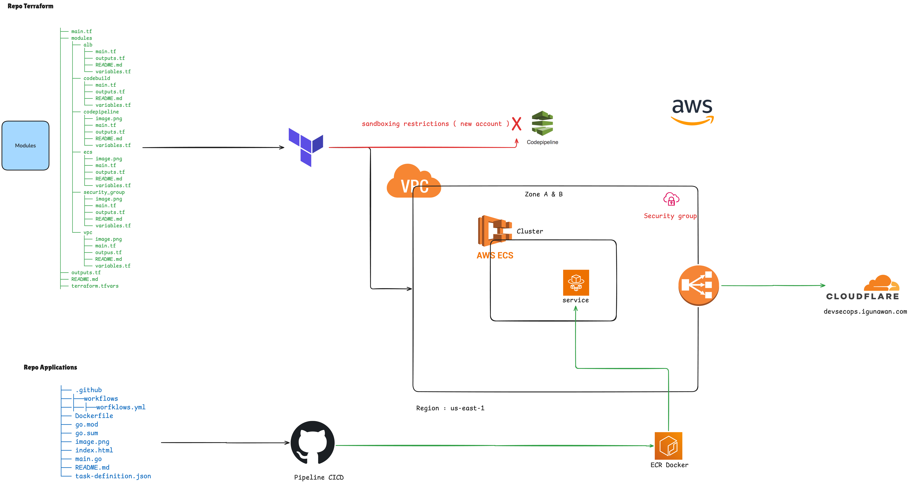

# Hello World Fullstack Application

Simple Hello World application with Go backend and vanilla JavaScript frontend.

## Infrastructure

### CI/CD Pipeline

This project uses a hybrid CI/CD approach with **GitHub Actions** as the primary CI provider and **AWS CodePipeline** for deployment to **ECS Fargate**:

- **GitHub Actions** (`.github/workflows/ecs-deploy.yml`): Handles Docker image building and pushing to Amazon ECR. This is the primary CI mechanism due to AWS account restrictions (Sandboxing) on new accounts that affect CodeBuild quotas.
- **AWS CodePipeline** (`buildspec.yml`): Orchestrates the CI/CD flow using CodeBuild, which is configured but currently has 0 executions due to the quota limitations.
- **AWS ECS Fargate**: Running the containerized application on serverless compute.

 Pipeline Flow:
```
Git Push → GitHub Actions → Build & Push to ECR → CodePipeline → Deploy to ECS Fargate
```

---

## Application Architecture



## Project Structure

```
.
├── go.mod                # Go module dependencies
├── main.go               # Go backend server (Gin)
├── index.html            # Frontend HTML/JS
├── Dockerfile            # Container image definition
├── task-definition.json  # ECS task definition template
├── buildspec.yml         # AWS CodeBuild specification
├── .github/
│   └── workflows/
│       └── ecs-deploy.yml # GitHub Actions CI/CD workflow
├── image.png             # Architecture diagram
└── README.md             # This file
```

## Features

- **Backend (Go + Gin)**
  - `GET /` - Returns Hello World message with author
  - `GET /health` - Health check endpoint with timestamp

- **Frontend (Vanilla JS)**
  - Displays Hello World message from backend
  - Health status indicator (auto-refresh every 5s)
  - Manual health check button
  - Responsive design with gradient background

## AWS Infrastructure

| Resource | Description |
|---|---|
| **ECS Fargate** | Serverless container orchestration |
| **ECR** | Docker image repository (apps-tf) |
| **VPC** | Isolated network with public & private subnets |
| **ALB** | Application Load Balancer routing port 80 → 8080 |
| **CloudWatch** | Container logs and monitoring |
| **IAM** | Task execution & task roles |
| **Security Groups** | Network-level access control |

## Deploy Commands

### Terraform Deployment

```bash
terraform init
terraform plan -var-file="terraform.tfvars"
terraform apply -var-file="terraform.tfvars"
```

### Docker

```bash
# Build
docker build -t hello-world-app .

# Run locally
docker run -d -p 8080:8080 --name hello-world hello-world-app

# View logs
docker logs -f hello-world

# Stop
docker stop hello-world && docker rm hello-world
```

## API Endpoints

| Method | Endpoint | Description | Example Response |
|--------|----------|-------------|------------------|
| GET | `/` | Hello World message | `{"message":"Hello World from Go backend!","author":"gunawan"}` |
| GET | `/health` | Health check | `{"status":"healthy","timestamp":1714321234}` |

## Cost Estimate

~$4–6/month (Fargate vCPU + memory + ALB + ECR storage). Zero cost outside running tasks.
